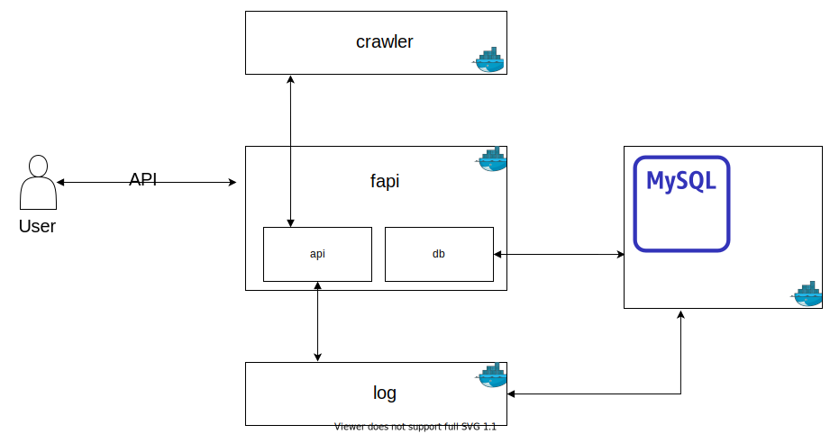
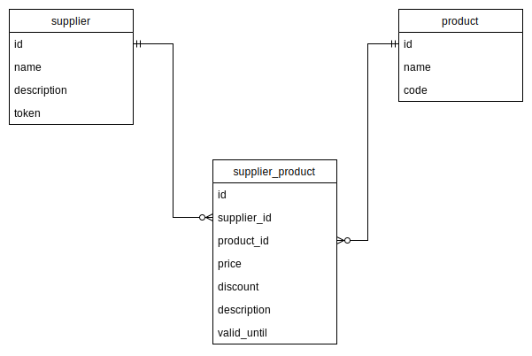
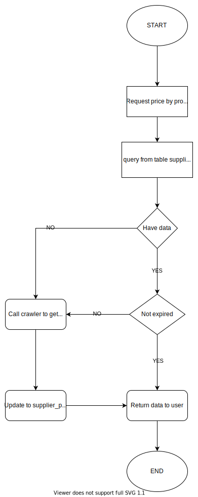

# Smart Choice

## Project status

https://sonarcloud.io/organizations/nguyenmanhdang90/projects

#### smartchoice-fapi: 

#### smartchoice-log:

#### smartchoice-crawler: 

---
## Development stack:

 1. [IntelliJ community](https://www.jetbrains.com/idea/)
 1. Java 8
 1. Docker
 1. Spring framework
 1. MySql
 1. maven
 1. liquibase

## CI tool

 1. Github actions
 1. Sonarcloud

---

## infrastructure

## smartchoice-fapi: 
 - front-end API.
 - Have two module which is api and db.
 - api contain REST API, also services and security.
 - db contain entities and repository.

## smartchocie-crawler
 - Simple spring application in charge of make request to third party.
 - communication by REST API
 - For further expand, this project can modify into clonable by the scale of the whole system

## smartchoice-log
 - have a service and a entities to store user action in to db
 - communication by REST API

=> All of these services is separated and run independence by docker, communication with each other by REST API

---
## Database structure

## supplier
 - Store list of already config supplier, ex: lazada, shopee

## product

 - Store list of already config product with product code map to third party, ex: apple iphone 1 with product code P1

## supplier_product

 - Store an many to many relation ship between supplier and product, also act as a cache layer for smartchoice-fapi with expiry time.
 - Data get from third party

---

## Work flow of get price from third party

## Start development process:

## How to run
